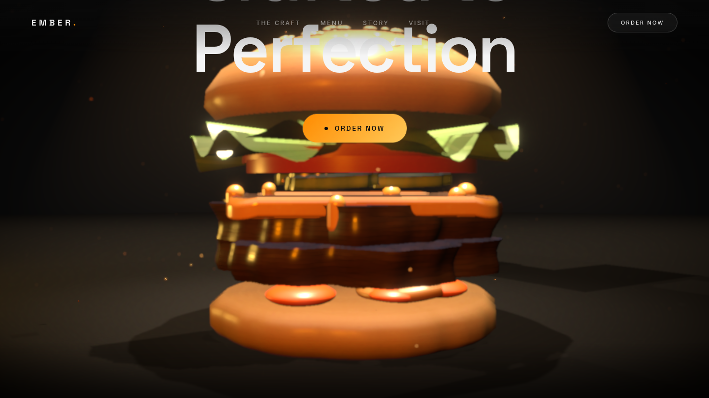

# EMBER — Smash Burger Atelier

An Awwwards-style landing page for a premium smash burger restaurant. The
hero is an ultra-stylized 3D burger whose nine ingredients float in space
and assemble themselves as you scroll — then explode apart in slow motion
and re-plate into a second variation.



## The scroll experience

| Section | Beat |
| --- | --- |
| 1 | Ingredients float weightlessly with independent drift, rotation, and cursor parallax |
| 2–3 | Layers descend and align bottom-up with per-ingredient stagger; sauce droplets fall onto the patties and splat; cheese melts over the meat |
| 4 | The stack lands with a squash-and-spring settle; camera dollies in |
| 5 | Slow turntable while "Crafted to Perfection" reveals per-character; magnetic **Order Now** CTA |
| 6 | Slow-motion radial explosion, then reassembly into **The Ember Royale** — lettuce under the meat, smoked-gouda tint, golden sauce |

## Tech

- **Next.js 15 (App Router) + TypeScript + React 19**
- **Three.js + React Three Fiber** — fully procedural scene: lathe-built brioche
  buns with 150 instanced sesame seeds, noise-displaced smashed patties with
  grill-marked caps, draped extruded cheese with animated drips, ruffled
  double-layer lettuce, translucent tomato wheels, canvas-generated PBR
  texture maps (zero external assets)
- **Lenis** smooth scrolling wired into the **GSAP** ticker; **ScrollTrigger**
  drives the character reveal
- **Framer Motion** for UI micro-interactions (magnetic buttons, preloader,
  section fades, custom cursor)
- **Postprocessing**: bloom, depth of field, vignette; planar floor
  reflections via `MeshReflectorMaterial`, volumetric key light, contact
  shadows, smoke + dust + crumb particles
- Procedural environment lighting (`Environment` + `Lightformer` — no HDRI
  downloads), warm ember rim light, cursor-reactive key light

## Performance

- Adaptive DPR + capped pixel ratio on mobile
- Mobile fallback: no depth of field / volumetric cone, reduced particle
  counts, lower shadow and reflection resolution
- Single shared frame-state object (no React state in the render loop),
  zero per-frame allocations, GPU instancing for seeds/crumbs
- Respects `prefers-reduced-motion`

## Run it

```bash
npm install
npm run dev    # http://localhost:3000
npm run build && npm start
```
